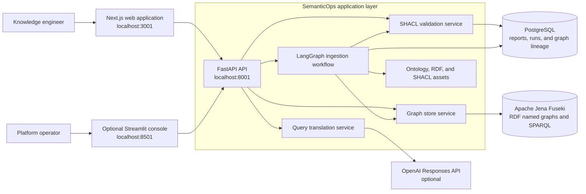

# SemanticOps

SemanticOps is an enterprise knowledge graph engineering platform for turning RDF assets into validated, governed, and query-ready named graphs. It combines a Next.js operations interface, a FastAPI application layer, SHACL validation, Apache Jena Fuseki, PostgreSQL, and a reusable LangGraph orchestration package.

## Objective

Enterprise knowledge graph delivery often requires separate tools and manual hand-offs for ontology management, RDF preparation, validation, promotion, querying, and operational tracking. SemanticOps brings those activities into one workflow so teams can:

- manage ontology and SHACL assets as version-controlled code;
- validate RDF before it reaches the graph store;
- promote approved data into queryable named graphs;
- register immutable ontology versions and link them to workflow runs;
- trace every promoted graph to its source checksum, validation report, ontology versions, and workflow run;
- retain validation reports and ingestion history;
- inspect graph inventory and workflow health from a web interface; and
- translate natural-language questions into reviewable, read-only SPARQL when OpenAI access is configured.

## Architecture



### Knowledge graph delivery flow

1. Select a registered RDF dataset or submit Turtle through the API or user interface.
2. Register each ontology by version and SHA-256 checksum, then promote new snapshots to immutable named graphs.
3. Parse the RDF and evaluate SHACL constraints with RDFS inference.
4. Persist the validation result and workflow state in PostgreSQL.
5. Promote conforming RDF to an isolated named graph in Fuseki and record its source checksum, validation report, ontology versions, and workflow run as lineage.
6. Query the promoted graph with SPARQL and monitor the outcome from the observability workspace.

Natural-language querying is an optional path. The generated SPARQL is returned for inspection, restricted to read-only query forms, and executed only when the user chooses to run it.

## How the objective is achieved

| Concern | Implementation |
| --- | --- |
| User experience | Next.js workspaces for operations, ingestion, ontology inspection, validation, observability, and the end-to-end demo |
| API and orchestration | FastAPI runs a typed LangGraph workflow that reuses the existing validation and graph-store services |
| Semantic governance | OWL/RDFS ontologies are registered by version and checksum, linked to each run, and validated with SHACL assets from `kg/` |
| Graph persistence | Fuseki stores named RDF graphs and provides the SPARQL endpoint |
| Operational persistence | PostgreSQL records validation reports, ingestion runs, ontology versions, and end-to-end promotion lineage |
| Agent orchestration | LangGraph executes ontology review, RDF preparation, validation, promotion, and observability with conditional failure routing |
| AI-assisted querying | The OpenAI Responses API generates structured SPARQL translations that are checked for read-only operations |
| Deployment | Docker Compose builds and connects the frontend, backend, PostgreSQL, and Fuseki services |

## Repository structure

| Path | Purpose |
| --- | --- |
| `frontend/` | Next.js and TypeScript web application |
| `backend/` | FastAPI API, application services, persistence, and Fuseki integration |
| `agents/` | LangGraph workflow and agent state definitions |
| `kg/` | Ontologies, SHACL shapes, and example RDF datasets |
| `streamlit_app/` | Optional operations and graph visualization console |
| `tests/` | Cross-service contract tests |
| `docs/` | Detailed architecture and engineering documentation |
| `docker/` | Supporting runtime configuration |

## Run the platform

### Prerequisites

- Docker Desktop with Docker Compose
- Git
- An OpenAI API key only if natural-language-to-SPARQL translation is required

### 1. Configure the environment

From the repository root:

```powershell
Copy-Item .env.example .env
```

The stack runs without an OpenAI key. To enable natural-language query translation, set `OPENAI_API_KEY` in `.env`; change `OPENAI_MODEL` there only when another available model is required.

### 2. Build and start all services

```powershell
docker compose up -d --build
docker compose ps
```

### 3. Verify the deployment

```powershell
Invoke-RestMethod http://localhost:8001/api/v1/health
```

Expected response:

```text
status service
------ -------
ok     semanticops-backend
```

Open the running services:

| Service | URL |
| --- | --- |
| SemanticOps web application | http://localhost:3001 |
| API documentation | http://localhost:8001/docs |
| Fuseki administration | http://localhost:3031 |
| PostgreSQL | `localhost:5433` |

### 4. Run the end-to-end workflow

Open http://localhost:3001/demo and select **Run full demo**. The demo loads ontology modules, runs ingestion for the synthetic medical cohort, validates the graph, promotes it to Fuseki, executes a SPARQL query, and refreshes the persisted operational metrics.

The same ingestion workflow can be started directly from PowerShell:

```powershell
$body = @{ dataset_key = "synthetic-medical-cohort" } | ConvertTo-Json
Invoke-RestMethod `
  -Method Post `
  -Uri http://localhost:8001/api/v1/workflows/ingestion/runs `
  -ContentType "application/json" `
  -Body $body
```

### 5. Stop the platform

```powershell
docker compose down
```

Add `--volumes` only when the PostgreSQL and Fuseki development data should also be removed.

## Optional Streamlit console

The Streamlit console provides graph visualization, manual validation, graph promotion, medical dataset loading, and direct SPARQL execution. Run it after the Compose stack is healthy:

```powershell
python -m pip install -r streamlit_app/requirements.txt
$env:SEMANTICOPS_API_URL = "http://localhost:8001"
python -m streamlit run streamlit_app/app.py
```

Then open http://localhost:8501.

## Development checks

Install local dependencies with `make install` where GNU Make is available, or use the package commands directly. Run the complete check set with:

```powershell
Push-Location backend
python -m pytest
python -m ruff check app tests
Pop-Location

Push-Location agents
python -m pytest
python -m ruff check semanticops_agents tests
Pop-Location

pnpm --dir frontend test
pnpm --dir frontend lint
```

See [`docs/`](docs/) for the detailed architecture, data model, API, deployment, and testing documentation.
